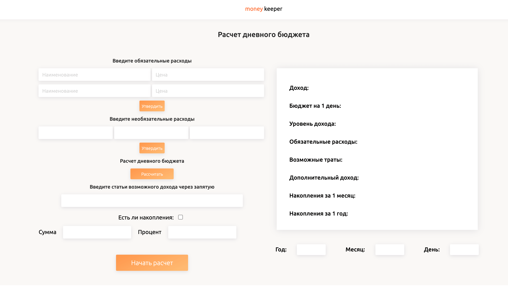
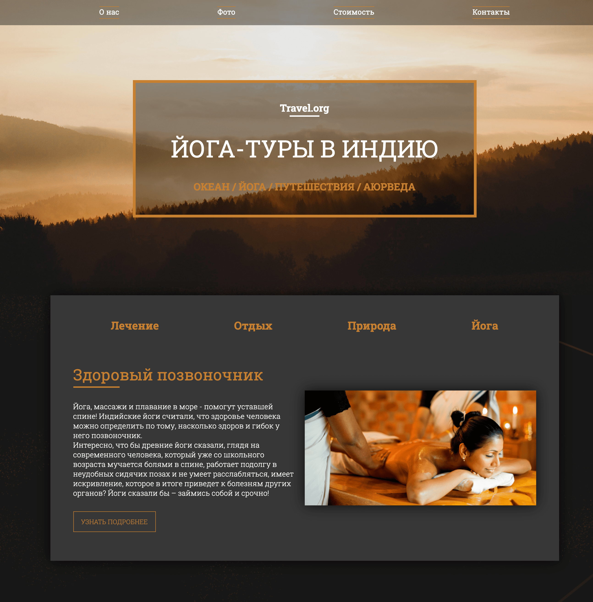

# Проект по курсу "Полный курс по Javascript + React"
## Автор курса: Иван Петриченко

### Краткое описание изученного материала:  
1. Основы программирования и алгоритмов.
2. Основы объектно ориентированного программирования.
3. Концепции и принципы JavaScript, от самых простых до самых сложных.
4. Работа с такими популярными технологиями как AJAX, JSON и тд.
5. Git и GitHub.
6. npm, Babel, Browserify, Webpack.
7. Библиотека React и создание 4 приложения на её основе.
8. Работа с Redux и интеграция инструмента в приложение.

**В этом репозитории изложена первая часть курса.**

[Первый проект второй части курса](https://github.com/winesf/todo)

[Второй проект второй части курса](https://github.com/winesf/gotapi)

#### Модуль 1

Изучается материал: 
 * Переменные типы данных их классификацию.
 * Интерполяция и как оно используется в стандарте ES6
 * Операторы
 * Условия и циклы.
 * Функции и применения callback функций
 * Методы и свойства, которые применяются при работе со строками и числами
 * Основные типы данных в JS - объекты, массивы и псевдомассивы
 * Передача по ссылке и по значению, Поверхностные и глубокие копии объектов. Понятие spread оператора
 * Парадигма программирования как ООП и в частности с одним из его стилей - прототипно-ОП.

**Финальный проект "калькулятор расчета бюджета"**

#### Модуль 2 (Теоритический)

* Разбор правильной работы с классами и такой прием как делегирование событий
* Запуск скриптов с течением времени
* Работа с датами в JS
* Глобальные объекты document,window, screen и параметры, которые есть у каждого элемента в JS
* Создание модального окна.
* Функции-конструкторы.
* This - контекст вызова.
* Классы
* Rest-оператор и параметры по умолчанию.

#### Модуль 3

* Формат передачи данных JSON и про глубокое клонирование объектов
* Общение клиента и сервера, использование технологии AJAX
* Промисы (обещания)
* Fetch API
* Методы перебора массивов: filter, map, reduce и др.
* Получение данных с сервера. Async/Await (ES8)
* Объект localStorage для хранения данных на сайте
* Свойства-акцессоры Геттеры и сеттеры
* Работа с библиотекой Jquery
* Событийный цикл

**Финальный проект "Landingpage Travel.org"**

